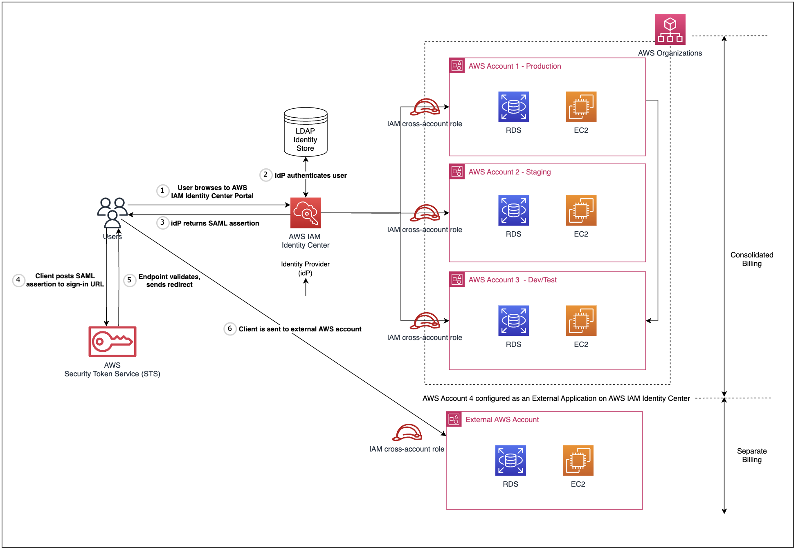

# Integrate external AWS accounts into AWS IAM Identity Center using Infrastructure-as-Code (IaC)

## What is this? 

This repository provides a deployable solution using Infrastructure-as-Code (IaC) templates with AWS CloudFormation to help you automate the configuration of AWS IAM Identity Center integration with external AWS accounts using SAML 2.0.

## Background and Primer 

AWS Organizations is an account management service that lets you consolidate multiple AWS accounts into an organization that you create and centrally manage. With Organizations, you can create member accounts and invite existing accounts to join your organization. You can organize those accounts into groups and attach policy-based controls.

AWS IAM Identity Center helps you securely create or connect your workforce identities and manage their access centrally across AWS accounts and applications. With IAM Identity Center, you can leverage a centralized identity provider as the access management mechanism across multiple AWS accounts within an AWS Organization.

## Problem Statement 

When AWS Organizations is used to centrally manage a fleet of AWS accounts, the consolidated billing feature helps you consolidate billing and payment for all AWS accounts in the Organization, helping you streamline cost management and combine usage across all accounts to share volume pricing discounts, Reserved Instance discounts and Savings Plans. This is particularly helpful for large Enterprises with large-scale workloads across multiple applications and account boundaries.

When an external AWS account is added to an existing Organization managed with IAM Identity Center, you can leverage the existing authentication mechanism to centrally manage that external AWS account and have its billing consolidated into the Organization.
However, there are times where you would like the central access management that comes with the merge, but have a business requirement to separate the billing of the external AWS account from that of the Organization. This cannot be implemented by adding the external AWS account into an existing Organization, as consolidated billing within an Organization, when enabled, applies to all member accounts of that Organization.

This requirement is common during corporate Mergers & Acquisitions (M&A) scenarios, where the technology stack of 2 
previously-separate entities are to be merged for central infrastructure management, but billing is to remain separate for commercial purposes of cost visibility or existing business constraints (E.g. Enterprise Discount Programs). This use-case is also often prevalent in companies with international operating entities, where billing reports for different regions or entitles are to be separated for tax and / or corporate auditing reasons.

## Solution Overview



The architecture diagram above showcases the proposed solution. By configuring IAM identity center to integrate an external AWS account using SAML, you can manage sign-in security for the external account using the same Identity Provider and SSO mechanism implemented for the AWS organization. This allows multiple separate AWS entities (multiple AWS external accounts can be integrated in the same way) to enjoy central access management with a single identity mechanism.

At the same time, as the external AWS account does not belong to the same AWS Organization, this set up will produce independent AWS billing - one consolidated bill for the Organization and individual bills for each external AWS account - allowing us to meet our aforementioned requirements.

_Note: the term “Primary AWS account” is used to indicate the AWS account with IAM Identity Center set-up and “External AWS account” is used to indicate the AWS account to be integrated._

## Deploy the Solution

You can implement the proposed solution in 2 ways:
- (1) - Using a click-through deployment procedure on the AWS Management Console. Detailed step-by-step guide can be found in a supplementary blog post [here](https://community.aws/content/2dIMI8N7w7tGxbE0KQMrkSBfae4/aws-iam-identity-center-integration-with-external-aws-accounts-for-independent-billing#implement-the-solution). 

- (2) - Using Infrastructure-as-Code (IaC) templates with AWS CloudFormation provided in this repository

This repository will outline a step-by-step guide to deploy the solution using IaC with AWS CloudFormation.

#### Prerequisites

Ensure you have the following prerequisites for the set-up:
- A primary AWS account with an existing AWS IAM Identity Center set-up 
- Access to the primary AWS account's IAM Identity Center console with permissions to manage and create applications
- An external AWS Account outside your Organization with admin permissions for AWS IAM and CloudFormation

### Deployment Steps

Follow the steps below to deploy the solution using IaC:

1. On the primary AWS account, go to AWS IAM Identity Center and create a customer-managed application for an external AWS account.

2. Download the IAM Identity Center SAML metadata file. _Step-by-step guide [here](https://community.aws/content/2dIMI8N7w7tGxbE0KQMrkSBfae4/aws-iam-identity-center-integration-with-external-aws-accounts-for-independent-billing#step-1-add-the-external-aws-account-as-an-application-to-aws-identity-center-in-primary-account)._

3. Open the  downloaded metadata file with a text editor, and copy its content (in UTF-8 XML) into our CloudFormation template `external_aws_account_cfn.yaml`. The metadata should go under the section  _SamlMetadataDocument_. 

```Resources:
  IdentityCenterSAMLProvider:
    Type: AWS::IAM::SAMLProvider
    Properties:
      Name: IdentityCenterSAMLProvider
      SamlMetadataDocument: |
        <EntityDescriptor xmlns="urn:oasis:names:tc:SAML:2.0:metadata">
          <!-- Replace this with your SAML metadata document -->
        </EntityDescriptor>
```
4.  Complete the _Statement_ parameter by filling in your custom IAM Policy to grant fine-grain permissions to users accessing our external AWS account. Adhering to the [principle of least privilege](https://aws.amazon.com/blogs/security/techniques-for-writing-least-privilege-iam-policies/#:~:text=Least%20privilege%20is%20a%20principle,build%20securely%20in%20the%20cloud.), we should only provide permissions to the smallest set of actions necessary to fulfill a specific task. 

```
      Policies:
        - PolicyName: "ExternalAccountPolicy"
          PolicyDocument:
            Version: "2012-10-17"
            Statement:
              - Effect: "Allow"
                Action: <!-- Replace this with your custom IAM Policy -->
                Resource: <!-- Replace this with your custom IAM Policy -->
```

5. Deploy the CloudFormation template `external_aws_account_cfn.yaml` on your external AWS account.

6. Record the following outputs from the CloudFormation template - you will need them for the following step. 
    - Account ID of external AWS Account
    - Name of Identity Center SAML Provider 
    - Name of IAM role created for external AWS account 
    
7. Navigate to the application (created in Step 1) on the AWS IAM Identity Center console on the primary AWS account.
Add 2 new attribute mappings, and fill them with the following: 

| User attribute in the application              | Maps to this string value or user attribute in IAM Identity Center | Format |
| :---------------- | :------: | ----: |
| https://aws.amazon.com/SAML/Attributes/Role        |   arn:aws:iam::ACCOUNTID:saml-provider/SAMLPROVIDERNAME,arn:aws:iam::ACCOUNTID:role/ROLENAME  | unspecified |
| https://aws.amazon.com/SAML/Attributes/RoleSessionName |   < Any Role Session Name >   | unspecified |

Replace the values of the above parameters with values extracted in Step 5:
- **ACCOUNTID** to be replaced with the AWS Account ID of the external AWS account   
- **SAMLPROVIDERNAME** to be replaced with the name of the SAML Identity Provider created in the external AWS account
- **ROLENAME** to be replaced with the name of the IAM Role created in the external AWS account

_Detailed step by step guide [here](https://community.aws/content/2dIMI8N7w7tGxbE0KQMrkSBfae4/aws-iam-identity-center-integration-with-external-aws-accounts-for-independent-billing#step-5-configure-access-details-of-created-iam-role-in-the-iam)._
 
## Limitations & Room for Development

1. As of date of publishing, it is not possible to automate the deployment of the entirety of the solution, as the creation of external applications on AWS IAM Identity Center using CloudFormation is not currently supported. Updates to the repository will be made once this feature is made possible on future date.

## Removal
To remove the solution from your AWS account, follow these steps:
1. On the primary AWS account, delete the customer-managed application through the AWS IAM Identity Center console page.
2. On the external AWS account, navigate to the deployed CloudFormation template and select **Delete stack**.

## License
This library is licensed under the MIT-0 License. See the LICENSE file.
